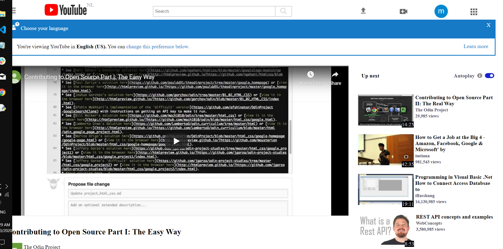

# Youtube Video Player Clone
For our first collaborative project at Microverse my coding partner and i make a clone of the youtube video player page using HTML5 sematics and clean code rules.

## Mock-up resource used
 * Our clone was made using this resource: http://archive.fo/Bss88

## Tools used
 * HTML5 and CSS3

## Live Page link 
 *Here is a link to our live page: https://mikenath223.github.io/Youtube-Video-Player-Clone/

## Features and Implemented guidelines

Features

<ul>
<li>The navbar has embedded image logo aligned to the leftmost part of the navbar and three embedded images at the rightmost part of it representing icons and avatar.</li>
<li>The mid section of the page contains an embedded video showing video title number of views and like and dislike icons and subcribe button.</li>
<li>The sidebar has a recommended video thumbnail preview that shows the title of the video and the nnumber of views.</li>
</ul>

  
Implemented guidelines

  <ul>
      <li>
        We styled and positioned elements as requested using CSS grid and css flexbox positioning system.
      </li>
      <li>
      We organized our commits into branches and then merged with master branch when we were done.
      </li>
      <li>
      We used BEM naming conventions and regular semantic HTML for better visibility.
      </li>
      <li>
       We validated our HTML with this tool from w3: https://validator.w3.org/#validate_by_upload .
      </li>
      <li>
      We worked and implemented all issues raised by our code reviewers.
      </li>
  </ul>
  
After-thoughts: It was a fun and great project to work on

## Snapshot

